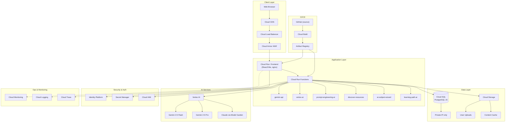
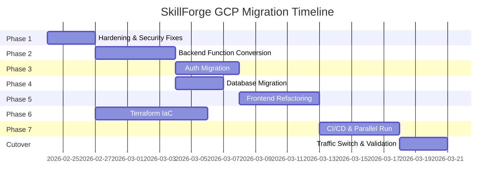

# SkillForge AI Coach — GCP Enterprise Migration Plan

**Gordon Foods Enterprise GCP Sandbox Deployment**

> [!IMPORTANT]
> This document is the **enterprise architecture plan** to present to Gordon Foods' enterprise architects. It covers the full migration from Lovable/Supabase to GCP, all required IAM permissions, GCP APIs, hardening measures, and a phased migration strategy.

---

## Executive Summary

SkillForge AI Coach is an AI-native learning platform currently hosted on **Lovable** (frontend hosting) with **Supabase** (PostgreSQL, Auth, Edge Functions, Storage) as the backend. The migration targets a **GCP enterprise sandbox** with hardened security, enterprise-grade IAM, and full Infrastructure-as-Code (Terraform).

### Current State → Target State

| Dimension | Current (Lovable/Supabase) | Target (GCP Enterprise) |
|---|---|---|
| **Frontend Hosting** | Lovable CDN | Cloud Run + Cloud CDN |
| **Backend Functions** | Supabase Edge Functions (Deno) | Cloud Run Functions (Node.js 20) |
| **Database** | Supabase PostgreSQL 15 | Cloud SQL for PostgreSQL 15 |
| **Authentication** | Supabase Auth (JWT) | Identity Platform / Firebase Auth |
| **Storage** | Supabase Storage | Cloud Storage |
| **AI Services** | Gemini API (direct key) | Vertex AI (service account) |
| **Secrets** | Supabase env vars | Secret Manager |
| **Networking** | Supabase managed | VPC + Cloud Armor + Private Service Connect |
| **CI/CD** | Lovable auto-deploy | Cloud Build + Artifact Registry |
| **Monitoring** | None | Cloud Monitoring, Logging, Trace |

---

## Architecture Diagram



---

## User Review Required

> [!CAUTION]
> **Breaking Authentication Change**: All existing Supabase users will need to be migrated to Identity Platform. Password hashes may not be directly portable — users may need a password reset email on first login to the new system.

> [!IMPORTANT]
> **Gordon Foods Enterprise Considerations**:
> 1. **VPC Service Controls** — Does Gordon Foods require VPC Service Controls perimeter around GCP resources?
> 2. **CMEK** — Should Customer-Managed Encryption Keys (CMEK) be used instead of Google-managed keys?
> 3. **Organization Policy Constraints** — What org-level policies are enforced (e.g., `constraints/compute.requireOsLogin`, `constraints/iam.allowedPolicyMemberDomains`)?
> 4. **Shared VPC** — Will this project connect to a Gordon Foods Shared VPC, or is it standalone?
> 5. **Data Classification** — Does any PII/PHI data flow through this app that requires special handling?
> 6. **SSO/SAML** — Should Identity Platform integrate with Gordon Foods' corporate SSO (Okta, Azure AD, etc.)?

---

## GCP APIs Required

All APIs that must be enabled in the GCP sandbox project:

```bash
gcloud services enable \
  cloudresourcemanager.googleapis.com \
  serviceusage.googleapis.com \
  iam.googleapis.com \
  compute.googleapis.com \
  run.googleapis.com \
  cloudfunctions.googleapis.com \
  sqladmin.googleapis.com \
  cloudbuild.googleapis.com \
  artifactregistry.googleapis.com \
  secretmanager.googleapis.com \
  aiplatform.googleapis.com \
  identitytoolkit.googleapis.com \
  firebase.googleapis.com \
  storage-api.googleapis.com \
  storage-component.googleapis.com \
  logging.googleapis.com \
  monitoring.googleapis.com \
  cloudtrace.googleapis.com \
  vpcaccess.googleapis.com \
  servicenetworking.googleapis.com \
  cloudarmor.googleapis.com \
  certificatemanager.googleapis.com \
  containeranalysis.googleapis.com
```

**Total: 23 APIs**

---

## IAM Permissions Matrix

### Service Accounts Required

| Service Account | Purpose | Required Roles |
|---|---|---|
| `skillforge-frontend@` | Cloud Run frontend container | `roles/run.invoker` |
| `skillforge-backend@` | Cloud Run Functions (all 6) | See detailed list below |
| `skillforge-db-admin@` | Database administration | `roles/cloudsql.admin` |
| `skillforge-build@` | CI/CD pipeline | `roles/cloudbuild.builds.builder`, `roles/artifactregistry.writer` |

### Backend Service Account — Detailed Permissions

The `skillforge-backend` service account needs the following roles (principle of least privilege):

| IAM Role | Justification |
|---|---|
| `roles/cloudsql.client` | Connect to Cloud SQL from Cloud Run Functions |
| `roles/aiplatform.user` | Invoke Vertex AI Gemini models |
| `roles/secretmanager.secretAccessor` | Read API keys and credentials from Secret Manager |
| `roles/storage.objectViewer` | Read from Cloud Storage buckets |
| `roles/storage.objectCreator` | Write user uploads and cached content |
| `roles/iam.serviceAccountTokenCreator` | Generate signed URLs for storage |
| `roles/logging.logWriter` | Write application logs |
| `roles/cloudtrace.agent` | Send trace data |
| `roles/monitoring.metricWriter` | Write custom metrics |

### Build Service Account — Detailed Permissions

| IAM Role | Justification |
|---|---|
| `roles/cloudbuild.builds.builder` | Execute builds |
| `roles/artifactregistry.writer` | Push container images |
| `roles/run.admin` | Deploy to Cloud Run |
| `roles/cloudfunctions.admin` | Deploy Cloud Functions |
| `roles/iam.serviceAccountUser` | Act as service accounts during deploy |

### Enterprise Admin Permissions (Human Users)

| Role | For Who | IAM Role |
|---|---|---|
| Project Owner | DevOps lead | `roles/owner` (sandbox only) |
| Project Editor | Developers | `roles/editor` (sandbox only) |
| Viewer | Enterprise architects | `roles/viewer` |
| Security Admin | SecOps | `roles/iam.securityAdmin` |

---

## Secrets Required in Secret Manager

| Secret Name | Description | Rotatable |
|---|---|---|
| `gemini-api-key` | Google AI Studio API key (fallback) | Yes |
| `db-connection-string` | Cloud SQL connection URI | No (auto-managed) |
| `jwt-signing-key` | JWT token signing key | Yes (quarterly) |
| `google-cloud-sa-key` | GCP service account key for Vertex AI | Yes |

> [!TIP]
> In an enterprise GCP setup, **Workload Identity Federation** should be used instead of service account keys wherever possible, eliminating the need for `google-cloud-sa-key`.

---

## Proposed Changes

### Phase 1 — Hardening (Pre-Migration)

Fix security issues in the current codebase before migration.

---

#### [MODIFY] [.env](file:///Users/euxvl/Documents/Vibecoding/skillforge-ai-coach/.env)
- Remove hardcoded Supabase credentials
- Replace with environment variable references
- Add `.env.example` template

#### [MODIFY] [client.ts](file:///Users/euxvl/Documents/Vibecoding/skillforge-ai-coach/src/integrations/supabase/client.ts)
- Replace hardcoded Supabase URL and anon key with `import.meta.env.VITE_*` variables
- This file currently has credentials directly in source code (line 5-6)

#### [MODIFY] [.gitignore](file:///Users/euxvl/Documents/Vibecoding/skillforge-ai-coach/.gitignore)
- Ensure `.env` is gitignored (verify)
- Add GCP credential file patterns

#### [MODIFY] All 6 edge functions — Error handling hardening
- [ai-subject-wizard/index.ts](file:///Users/euxvl/Documents/Vibecoding/skillforge-ai-coach/supabase/functions/ai-subject-wizard/index.ts) — Currently leaks raw error messages (line 245)
- Ensure all functions use `getSafeErrorMessage()` consistently

---

### Phase 2 — Backend Conversion (Supabase Edge Functions → Cloud Run Functions)

Convert all 6 Deno-based Supabase Edge Functions to Node.js 20 Cloud Run Functions.

---

#### [NEW] [functions/gemini-api/index.js](file:///Users/euxvl/Documents/Vibecoding/skillforge-ai-coach/functions/gemini-api/index.js)
- Convert from Deno `serve()` to Express.js
- Replace `Deno.env.get()` → `process.env`
- Replace Supabase auth validation → Firebase Admin SDK JWT verification
- Use `@google-cloud/vertexai` SDK instead of direct API key calls

#### [NEW] [functions/vertex-ai/index.js](file:///Users/euxvl/Documents/Vibecoding/skillforge-ai-coach/functions/vertex-ai/index.js)
- Same Deno→Node.js conversion
- Replace manual JWT generation with Application Default Credentials (ADC)
- Remove `generateJWT()` and `getAccessToken()` helper functions (lines 210-275)

#### [NEW] [functions/prompt-engineering-ai/index.js](file:///Users/euxvl/Documents/Vibecoding/skillforge-ai-coach/functions/prompt-engineering-ai/index.js)
- Convert to Express.js, replace `SUPABASE_SERVICE_ROLE_KEY` with Cloud SQL direct connection
- Replace `supabase.from('prompt_experiments').update()` → SQL query via `pg` driver

#### [NEW] [functions/discover-resources/index.js](file:///Users/euxvl/Documents/Vibecoding/skillforge-ai-coach/functions/discover-resources/index.js)
- Convert DB writes from Supabase client → `pg` driver with Cloud SQL
- Replace `supabase.from('learning_resources').insert()` → direct SQL INSERT

#### [NEW] [functions/ai-subject-wizard/index.js](file:///Users/euxvl/Documents/Vibecoding/skillforge-ai-coach/functions/ai-subject-wizard/index.js)
- Convert to Express.js

#### [NEW] [functions/learning-path-ai/index.js](file:///Users/euxvl/Documents/Vibecoding/skillforge-ai-coach/functions/learning-path-ai/index.js)
- Simpler conversion — no DB interaction, just Gemini API calls
- This function doesn't require JWT (currently `verify_jwt = false`)

#### [NEW] [functions/package.json](file:///Users/euxvl/Documents/Vibecoding/skillforge-ai-coach/functions/package.json)
- Shared dependencies: `express`, `cors`, `firebase-admin`, `@google-cloud/vertexai`, `pg`

---

### Phase 3 — Auth Migration (Supabase Auth → Identity Platform)

---

#### [MODIFY] [UserContext.tsx](file:///Users/euxvl/Documents/Vibecoding/skillforge-ai-coach/src/contexts/UserContext.tsx)
- Replace `@supabase/supabase-js` auth calls → Firebase Auth SDK
- Replace `supabase.auth.signInWithPassword()` → `signInWithEmailAndPassword()`
- Replace `supabase.auth.signUp()` → `createUserWithEmailAndPassword()`
- Replace `supabase.auth.onAuthStateChange()` → `onAuthStateChanged()`
- Replace `supabase.auth.getSession()` → `getAuth().currentUser`

#### [MODIFY] [AuthPage.tsx](file:///Users/euxvl/Documents/Vibecoding/skillforge-ai-coach/src/pages/AuthPage.tsx)
- Update login/signup forms to use Firebase Auth

#### [NEW] [src/integrations/firebase/client.ts](file:///Users/euxvl/Documents/Vibecoding/skillforge-ai-coach/src/integrations/firebase/client.ts)
- Firebase app initialization
- Auth, Firestore references (if needed)

---

### Phase 4 — Database Migration (Supabase PostgreSQL → Cloud SQL)

---

#### [NEW] [migrations/consolidated_schema.sql](file:///Users/euxvl/Documents/Vibecoding/skillforge-ai-coach/migrations/consolidated_schema.sql)
- Consolidate all 19 Supabase migrations into a single Cloud SQL compatible schema
- Remove all `auth.users` references → use application-managed user IDs
- Remove Supabase-specific RLS policies (use app-level auth)
- Remove `auth.uid()` function calls
- Preserve all tables: `profiles`, `learning_goals`, `scenarios`, `user_scenario_progress`, `skill_assessments`, `achievements`, `ai_coaching_sessions`, `syllabus_progress`, `content_cache`, `learning_subjects`, `user_subject_enrollments`, `user_roles`, `learning_resources`, `feedback`, `prompt_experiments`, `scenario_analytics`

#### [NEW] [scripts/migrate-data.sh](file:///Users/euxvl/Documents/Vibecoding/skillforge-ai-coach/scripts/migrate-data.sh)
- Export data from Supabase using `pg_dump`
- Import into Cloud SQL
- Verify row counts

---

### Phase 5 — Frontend Refactoring

---

#### [NEW] [src/integrations/gcp/database.ts](file:///Users/euxvl/Documents/Vibecoding/skillforge-ai-coach/src/integrations/gcp/database.ts)
- API client that calls Cloud Run Functions instead of Supabase PostgREST
- Provides `query()`, `insert()`, `update()`, `delete()` methods matching Supabase client API shape for minimal refactoring

#### [MODIFY] ~30 files that import from `@/integrations/supabase/client`
- Replace `supabase.from('table').select()` pattern → API calls to Cloud Run backend
- Key files:
  - All 14 files in [src/services/](file:///Users/euxvl/Documents/Vibecoding/skillforge-ai-coach/src/services)
  - [UserContext.tsx](file:///Users/euxvl/Documents/Vibecoding/skillforge-ai-coach/src/contexts/UserContext.tsx)
  - Admin components, analytics components

---

### Phase 6 — Infrastructure as Code (Terraform)

---

#### [NEW] [terraform/](file:///Users/euxvl/Documents/Vibecoding/skillforge-ai-coach/terraform/) directory
- `main.tf` — Provider, variable definitions, module references
- `modules/networking/` — VPC, subnets, firewall, VPC connector
- `modules/iam/` — Service accounts, role bindings
- `modules/cloud-sql/` — PostgreSQL instance, databases, users
- `modules/cloud-run/` — Frontend service, function deployments
- `modules/storage/` — Buckets with lifecycle policies
- `modules/security/` — Cloud Armor policies, Secret Manager
- `modules/monitoring/` — Dashboards, alerts, uptime checks
- `environments/sandbox/` — Gordon Foods sandbox-specific vars

---

### Phase 7 — CI/CD Pipeline

---

#### [NEW] [cloudbuild.yaml](file:///Users/euxvl/Documents/Vibecoding/skillforge-ai-coach/cloudbuild.yaml)
- Build frontend container → push to Artifact Registry → deploy to Cloud Run
- Build function containers → deploy to Cloud Functions
- Run integration tests

#### [NEW] [Dockerfile](file:///Users/euxvl/Documents/Vibecoding/skillforge-ai-coach/Dockerfile)
- Multi-stage build: Node.js builder → nginx for production serving

---

## Migration Strategy — Phased Approach



### Phase Descriptions

| Phase | Duration | Description |
|---|---|---|
| **1. Hardening** | 3 days | Remove hardcoded creds, fix error leaks, update `.gitignore` |
| **2. Backend** | 5 days | Convert 6 Deno Edge Functions → Node.js Cloud Run Functions |
| **3. Auth** | 4 days | Migrate Supabase Auth → Identity Platform, update frontend |
| **4. Database** | 3 days | Consolidate schema, export Supabase data, import to Cloud SQL |
| **5. Frontend** | 5 days | Replace ~30 Supabase client integrations with GCP API calls |
| **6. IaC** | 7 days | Write Terraform modules for full GCP infra (parallel with Phase 2-5) |
| **7. CI/CD** | 5 days | Cloud Build pipeline, Artifact Registry, automated deployment |

---

## Cost Estimate (Sandbox)

| Service | Monthly Estimate | Notes |
|---|---|---|
| Cloud Run (frontend) | $15–30 | Min instances: 0 for sandbox |
| Cloud Run Functions (6) | $10–25 | Pay-per-invocation |
| Cloud SQL (db-f1-micro) | $8–15 | Sandbox tier |
| Cloud Storage | $1–5 | Minimal for sandbox |
| Vertex AI | $10–50 | Usage-based, depends on testing volume |
| Secret Manager | $0.06/secret/mo | Negligible |
| Cloud Armor | $5/policy/mo | Basic policy |
| Cloud Build | $0–3 | 120 free mins/day |
| **Total Sandbox** | **~$50–130/mo** | |

---

## Verification Plan

### Automated Tests
1. **TypeScript build verification**: `npm run build` — must pass with 0 errors after all frontend changes
2. **Lint check**: `npm run lint` — verify no regressions
3. **Cloud Function deploy check**: Deploy each function to sandbox with `gcloud functions deploy --dry-run`
4. **Schema migration test**: Run consolidated SQL against a local PostgreSQL container
   ```bash
   docker run -d --name test-db -e POSTGRES_PASSWORD=test -p 5433:5432 postgres:15
   psql -h localhost -p 5433 -U postgres -f migrations/consolidated_schema.sql
   ```

### Manual Verification
1. **Auth flow**: Sign up → Sign in → Sign out via the web UI on the sandbox deployment
2. **AI function test**: Trigger each Cloud Run Function via `curl` with a test JWT
3. **Data integrity**: Compare row counts between Supabase export and Cloud SQL import
4. **End-to-end**: Complete one full learning path workflow (select subject → interact with Jarvis coach → view progress)

> [!NOTE]
> The existing codebase has no test framework (no Jest/Vitest configuration found in `package.json`). Adding a test framework is recommended as a follow-up hardening step but is not blocking the migration.
