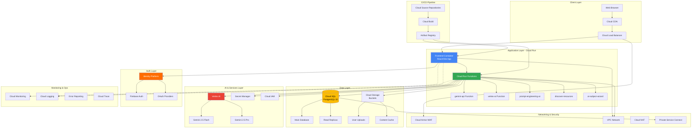

# AI SkillForge - GCP Production Architecture

## Executive Summary

This document outlines the complete architecture for deploying AI SkillForge to Google Cloud Platform (GCP), migrating from the current Supabase-based development environment to a production-grade enterprise infrastructure.

**Target State:** Fully containerized, auto-scaling, enterprise-grade deployment on GCP with equivalent functionality to current Supabase implementation.

---

## Architecture Diagram



---

## Component Specifications

### 1. Frontend Layer (Cloud Run)

**Service:** `ai-skillforge-frontend`

**Technology Stack:**
- React 18.3.1 with TypeScript
- Vite 5.x build system
- Tailwind CSS + Radix UI components
- React Router 6.26.2 for routing

**Container Specifications:**
```dockerfile
FROM node:20-alpine AS builder
WORKDIR /app
COPY package*.json ./
RUN npm ci --only=production
COPY . .
RUN npm run build

FROM nginx:alpine
COPY --from=builder /app/dist /usr/share/nginx/html
COPY nginx.conf /etc/nginx/nginx.conf
EXPOSE 8080
CMD ["nginx", "-g", "daemon off;"]
```

**Resource Requirements:**
- CPU: 1 vCPU
- Memory: 512 MB - 2 GB
- Max Instances: 100
- Min Instances: 1 (for production) or 0 (for dev/staging)
- Concurrency: 80 requests per instance
- Request timeout: 300 seconds

**Environment Variables:**
```bash
VITE_GCP_PROJECT_ID=your-project-id
VITE_CLOUD_SQL_CONNECTION=project:region:instance
VITE_GEMINI_API_ENDPOINT=https://us-central1-aiplatform.googleapis.com
VITE_FRONTEND_URL=https://skillforge.yourdomain.com
VITE_API_BASE_URL=https://api.skillforge.yourdomain.com
```

**Scaling Policy:**
- Target CPU Utilization: 70%
- Target Request Utilization: 60%
- Scale up: 2x instances when threshold exceeded for 60s
- Scale down: Remove 1 instance every 5 minutes if below threshold

---

### 2. Backend Layer (Cloud Run Functions)

**Migration from Supabase Edge Functions → Cloud Run Functions**

#### Function 1: `gemini-api`
**Purpose:** Proxy for Gemini AI API calls with user authentication

**Runtime:** Node.js 20
**Memory:** 512 MB
**Timeout:** 60s
**Concurrency:** 1 (due to streaming responses)

**Code Changes Required:**
- Convert from Deno to Node.js runtime
- Replace `Deno.serve` with Express.js
- Update `Deno.env.get()` to `process.env`
- Implement CORS using `cors` middleware
- Replace Supabase auth with Identity Platform tokens

**API Endpoint:** `POST /gemini-api`
**Request Body:**
```json
{
  "prompt": "string",
  "temperature": 0.7,
  "maxTokens": 2048,
  "systemPrompt": "string",
  "responseSchema": {}
}
```

#### Function 2: `vertex-ai`
**Purpose:** Multi-model AI gateway (Claude, Gemini)

**Runtime:** Node.js 20
**Memory:** 1 GB
**Timeout:** 120s
**Concurrency:** 10

**Dependencies:**
- `@google-cloud/aiplatform`
- `google-auth-library`
- JWT verification middleware

#### Function 3: `prompt-engineering-ai`
**Purpose:** Interactive prompt engineering tutor

**Runtime:** Node.js 20
**Memory:** 512 MB
**Timeout:** 60s

**Actions Supported:**
- `analyze_prompt`
- `generate_exercise`
- `evaluate_response`
- `get_feedback`

#### Function 4: `discover-resources`
**Purpose:** AI-powered learning resource discovery

**Runtime:** Node.js 20
**Memory:** 512 MB
**Timeout:** 90s

**External APIs:**
- Gemini API for resource generation
- Cloud SQL for resource storage

#### Function 5: `ai-subject-wizard`
**Purpose:** Subject/curriculum generation wizard

**Runtime:** Node.js 20
**Memory:** 512 MB
**Timeout:** 90s

**Actions:**
- `analyze` - Topic suitability assessment
- `generate_syllabus` - Course outline creation
- `generate_metadata` - SEO and metadata
- `generate_prompt` - AI coach prompt generation

---

### 3. Database Layer (Cloud SQL for PostgreSQL)

**Instance Specifications:**

**Development:**
- Tier: `db-f1-micro`
- vCPUs: 1 shared
- Memory: 0.6 GB
- Storage: 10 GB SSD
- Backups: Daily, 7-day retention
- High Availability: None

**Production:**
- Tier: `db-n1-standard-2`
- vCPUs: 2
- Memory: 7.5 GB
- Storage: 100 GB SSD (auto-increase enabled)
- Backups: Automated daily, 30-day retention
- High Availability: Regional (multi-zone)
- Read Replicas: 1-2 in different zones
- Point-in-Time Recovery: Enabled

**Database Schema:** 30+ tables including:

**Core Tables:**
- `profiles` - User profile data
- `user_roles` - RBAC with enum('admin', 'moderator', 'user')
- `subjects` - Learning subjects/courses
- `syllabus_sections` - Course curriculum
- `user_progress` - Learning progress tracking
- `content_cache` - AI-generated content cache
- `learning_resources` - Curated learning materials
- `feedback` - User feedback and analytics
- `prompt_experiments` - Prompt engineering exercises
- `scenario_analytics` - Learning scenario metrics
- `user_enrollments` - Course enrollments

**Row-Level Security (RLS) Migration:**

Cloud SQL doesn't have native RLS like Supabase. Options:

1. **Application-Level Security (Recommended)**
   - Implement in Cloud Run Functions
   - Use service account with minimal permissions
   - Query filtering based on authenticated user ID

2. **PostgreSQL Policies (Manual Implementation)**
   ```sql
   -- Enable RLS on table
   ALTER TABLE profiles ENABLE ROW LEVEL SECURITY;
   
   -- Create policy
   CREATE POLICY "Users can view own profile" ON profiles
   FOR SELECT USING (user_id = current_setting('app.user_id')::uuid);
   ```
   
   - Set session variable on connection
   - More complex, harder to maintain

3. **Service Accounts per Function**
   - Dedicated service account per Cloud Run Function
   - Granular IAM permissions
   - Query-level access control

**Recommended:** Option 1 + Option 3 combination

---

### 4. Storage Layer (Cloud Storage)

**Buckets:**

1. **User Uploads Bucket**
   - Name: `${PROJECT_ID}-user-uploads`
   - Location: Multi-region (US, EU, or ASIA)
   - Storage Class: Standard
   - Public Access: Blocked
   - Lifecycle: Delete objects older than 365 days
   - Versioning: Enabled
   - IAM:
     - Authenticated users: Storage Object Creator
     - Cloud Run Functions: Storage Object Viewer/Admin

2. **Content Cache Bucket**
   - Name: `${PROJECT_ID}-content-cache`
   - Location: Regional (same as Cloud Run)
   - Storage Class: Standard
   - Public Access: Blocked
   - Lifecycle: Delete objects older than 90 days
   - Versioning: Disabled
   - IAM: Cloud Run Functions only

3. **Static Assets Bucket**
   - Name: `${PROJECT_ID}-static-assets`
   - Location: Multi-region
   - Storage Class: Standard
   - Public Access: Allowed (via Cloud CDN)
   - Lifecycle: None
   - Versioning: Enabled for rollback

**Signed URLs:**
- Generate temporary URLs for user uploads
- Expiry: 15 minutes
- Service account with `roles/iam.serviceAccountTokenCreator`

---

### 5. Authentication (Identity Platform / Firebase Auth)

**Options:**

**Option A: Firebase Authentication (Recommended)**
- Drop-in replacement for Supabase Auth
- Email/Password, Google, GitHub providers
- JWT tokens compatible with IAM
- Client SDKs for web
- User management UI

**Option B: Identity Platform**
- Enterprise-grade authentication
- SAML, OIDC support
- Multi-tenancy
- Advanced security features
- Higher cost

**Recommended:** Firebase Authentication for initial migration

**Migration Steps:**
1. Export users from Supabase (if password hashes available)
2. Create Firebase project
3. Enable authentication providers
4. Import users via Admin SDK
5. Update frontend to use Firebase SDK
6. Implement JWT verification in Cloud Run Functions

**User Data Migration:**
```javascript
// Supabase export
const { data: users } = await supabase.auth.admin.listUsers();

// Firebase import
const admin = require('firebase-admin');
users.forEach(user => {
  admin.auth().createUser({
    uid: user.id, // Maintain UUID
    email: user.email,
    emailVerified: user.email_confirmed_at !== null,
    displayName: user.raw_user_meta_data?.name,
    photoURL: user.raw_user_meta_data?.avatar_url,
  });
});
```

---

### 6. AI Services (Vertex AI)

**Gemini API Integration**

**Models Available:**
- `gemini-2.5-flash` - Fast, cost-effective (Default)
- `gemini-2.5-pro` - Advanced reasoning
- `gemini-2.5-flash-lite` - Lowest cost

**Vertex AI Configuration:**
```javascript
const { VertexAI } = require('@google-cloud/vertexai');

const vertexAI = new VertexAI({
  project: process.env.GCP_PROJECT_ID,
  location: 'us-central1'
});

const model = vertexAI.getGenerativeModel({
  model: 'gemini-2.5-flash',
  generationConfig: {
    temperature: 0.7,
    topP: 0.95,
    maxOutputTokens: 8192,
  }
});
```

**API Quotas:**
- Requests per minute: 300 (default)
- Tokens per minute: 4M (input) + 8K (output)
- Request increase via quota console

**Cost Optimization:**
- Use `gemini-2.5-flash-lite` for simple tasks
- Implement response caching in Cloud SQL
- Set appropriate `maxOutputTokens`
- Monitor usage via Cloud Monitoring

---

### 7. Networking & Security

**VPC Network:**
- Name: `ai-skillforge-vpc`
- Subnets:
  - `frontend-subnet` (10.0.1.0/24) - Cloud Run frontend
  - `backend-subnet` (10.0.2.0/24) - Cloud Run Functions
  - `data-subnet` (10.0.3.0/24) - Cloud SQL, private
- Firewall Rules:
  - Allow HTTPS (443) from anywhere to Load Balancer
  - Allow internal traffic between subnets
  - Deny all other ingress

**Cloud Armor (WAF):**
- Security Policies:
  - Rate limiting: 100 requests/minute per IP
  - OWASP Top 10 protection
  - SQL injection prevention
  - XSS protection
  - Geo-blocking (optional)
- Attach to Load Balancer backend

**Private Service Connect:**
- Cloud SQL accessible only via private IP
- No public IP exposure
- Secure connection from Cloud Run via VPC connector

**Secret Manager:**
- Store all API keys, credentials:
  - `gemini-api-key`
  - `database-connection-string`
  - `jwt-signing-key`
  - `oauth-client-secrets`
- Version management enabled
- Automatic rotation for critical secrets
- IAM: Cloud Run service accounts only

**SSL/TLS:**
- Google-managed SSL certificates
- Automatic renewal
- TLS 1.2+ only
- HSTS headers enabled

---

### 8. Monitoring & Observability

**Cloud Monitoring:**
- Dashboards:
  - Application Performance (latency, errors, throughput)
  - Infrastructure Health (CPU, memory, disk)
  - Cost Tracking
  - AI API Usage
- Alerts:
  - Error rate > 5% for 5 minutes
  - P95 latency > 2 seconds for 10 minutes
  - Cloud SQL connections > 80%
  - Storage bucket usage > 90%
  - Cost anomaly detection

**Cloud Logging:**
- Log types:
  - Application logs (INFO, WARN, ERROR)
  - Access logs (all HTTP requests)
  - Audit logs (admin actions)
  - Security logs (auth failures)
- Retention: 30 days (standard), 1 year (compliance)
- Log sinks:
  - BigQuery for analysis
  - Cloud Storage for long-term archive

**Error Reporting:**
- Automatic error grouping
- Stack trace capture
- Email/Slack notifications
- Integration with Cloud Logging

**Cloud Trace:**
- Distributed tracing for requests
- Latency breakdown (frontend → functions → database → AI)
- Bottleneck identification

**Uptime Checks:**
- HTTPS checks every 1 minute
- Check locations: 6 global regions
- Alert on 2 consecutive failures

---

## Traffic Flow

### User Request Flow

1. **User Request** → Cloud CDN (cache check)
2. **Cache Miss** → Cloud Load Balancer
3. **Load Balancer** → Cloud Armor (security check)
4. **Cloud Armor** → Cloud Run Frontend
5. **Frontend** → Identity Platform (authentication)
6. **Authenticated Request** → Cloud Run Function
7. **Function** → Cloud SQL (data fetch) / Vertex AI (AI generation)
8. **Response** → Frontend → CDN Cache → User

**Latency Targets:**
- Frontend (cached): < 100ms
- Frontend (uncached): < 500ms
- API calls: < 2 seconds
- AI generation: < 10 seconds (streaming)

---

## High Availability & Disaster Recovery

**High Availability:**
- Multi-zone Cloud Run deployment
- Cloud SQL with HA configuration (automatic failover)
- Load balancer with health checks
- Auto-scaling based on traffic

**Disaster Recovery:**
- **RTO (Recovery Time Objective):** 4 hours
- **RPO (Recovery Point Objective):** 1 hour
- Automated database backups (daily + point-in-time)
- Cross-region backup storage
- Infrastructure as Code (Terraform) for quick rebuild
- Documented runbook for DR procedures

**Backup Strategy:**
- Database: Automated daily snapshots + transaction logs
- Storage: Versioning enabled, cross-region replication
- Code: Git repository with tags for releases
- Configuration: Secret Manager with versions

---

## Compliance & Governance

**Data Residency:**
- Configurable region selection
- Data stays in selected region(s)
- Meet GDPR, CCPA requirements

**Access Control:**
- Principle of least privilege
- Service accounts per function
- IAM bindings with conditions
- Audit logging for all access

**Data Protection:**
- Encryption at rest (Google-managed keys)
- Encryption in transit (TLS 1.2+)
- Customer-managed encryption keys (CMEK) option
- DLP API for sensitive data scanning (optional)

**Audit & Compliance:**
- Cloud Audit Logs enabled
- Access transparency logs
- SOC 2, ISO 27001 compliance (GCP infrastructure)
- Regular security scans with Security Command Center

---

## Scaling Considerations

**Current Scale (Development):**
- Users: < 100
- Requests/day: < 1,000
- Database size: < 1 GB
- Storage: < 10 GB

**Target Scale (Production - Year 1):**
- Users: 10,000 - 50,000
- Requests/day: 100,000 - 500,000
- Database size: 10 - 50 GB
- Storage: 100 GB - 1 TB

**Target Scale (Production - Year 3):**
- Users: 100,000 - 500,000
- Requests/day: 1M - 5M
- Database size: 100 GB - 500 GB
- Storage: 1 TB - 10 TB

**Scaling Strategy:**
- Horizontal scaling for Cloud Run (auto)
- Vertical scaling for Cloud SQL (manual, scheduled)
- Read replicas for database scaling
- CDN for static content delivery
- Caching layer (Cloud Memorystore) for high traffic

---

## Migration Path from Supabase

**Phase 1: Infrastructure Setup (Week 1)**
- GCP project creation and configuration
- VPC and networking setup
- Cloud SQL provisioning
- Identity Platform setup

**Phase 2: Data Migration (Week 2)**
- Schema migration to Cloud SQL
- User data export and import
- Content and resource migration
- RLS policy conversion

**Phase 3: Application Migration (Week 3)**
- Frontend containerization
- Edge Functions conversion to Cloud Run Functions
- Environment variable configuration
- Integration testing

**Phase 4: Parallel Run (Week 4)**
- Deploy to production
- Run Supabase and GCP in parallel
- Monitor metrics and errors
- Gradual traffic shift (10% → 50% → 100%)

**Phase 5: Cutover (Week 5)**
- Complete traffic migration to GCP
- Decommission Supabase
- Final data sync
- Post-migration validation

---

## Cost Comparison

**Current (Supabase - Estimated):**
- Free tier → $25/month (Pro plan)
- Additional usage: ~$50-100/month
- **Total: $75-125/month**

**GCP (Projected):**
- Cloud Run: $30-80/month
- Cloud SQL: $50-150/month
- Cloud Storage: $5-20/month
- Vertex AI: $20-100/month (usage-based)
- Networking: $10-30/month
- **Total: $115-380/month**

**Break-even:** ~5,000 active users

**Cost Optimization Tips:**
- Use committed use discounts (1-year: 37% off, 3-year: 55% off)
- Right-size Cloud SQL instances
- Implement aggressive caching
- Use Cloud CDN for static content
- Monitor and set budget alerts

---

## Next Steps

1. Review and approve architecture with enterprise architects
2. Request GCP project and quota increases
3. Begin Phase 1: Infrastructure Setup
4. Schedule migration cutover window
5. Prepare rollback procedures

---

**Document Version:** 1.0  
**Last Updated:** 2025-01-27  
**Author:** AI SkillForge DevOps Team  
**Review Status:** Pending Enterprise Architect Approval
